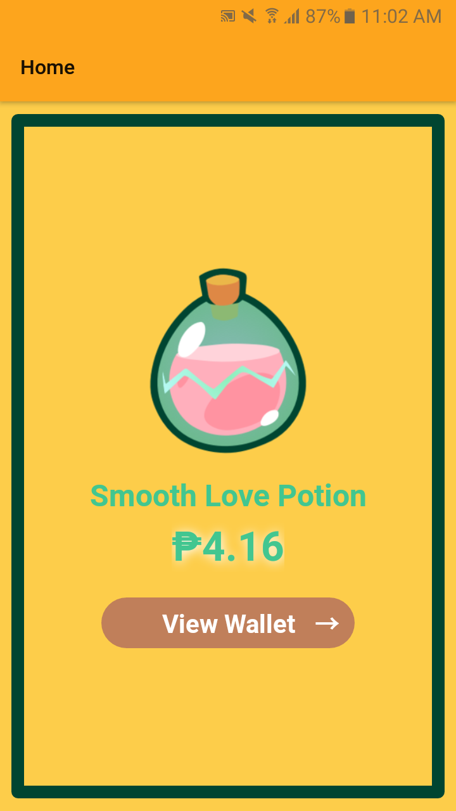
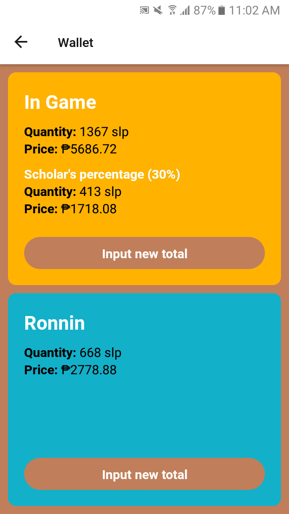

# Scholar's Wallet
**A react-native typescript sample app**

### A little background for this personal project.
- Smooth Love Potion or SLP is one of the currencies of the NFT game Axie Infinity.
- A scholarship system is widely used in this game 
- A manager would take buy and/or breed Axie teams which is currently around 1500usd to buy nowadays
- And scholars will be hired to play the teams in exchange for a percentage of the SLP earnings of the team
- In game SLP earnings are harvested every 15 days and the scholar's share is sent to their Ronnin wallet

### This app uses:
- axios to request coin data from [CoinGecko API](https://www.coingecko.com/en/api/documentation) every minute
- react-redux and redux-thunk for state management which can make the scaling of the project easier
- react-navigation-stack to go from home screen to wallet screen and back

**These are main features that haven't been implemented yet as of Sept. 13**
- Upon clicking the "input new total" in the wallet screen, a pop-up with input text should appear to let user input their latest account details
- Use of AsyncStorage to store the user's wallet details

Currently, the app is very catered to my personal needs. But personalization settings can be added in the future, or even other coin option.
